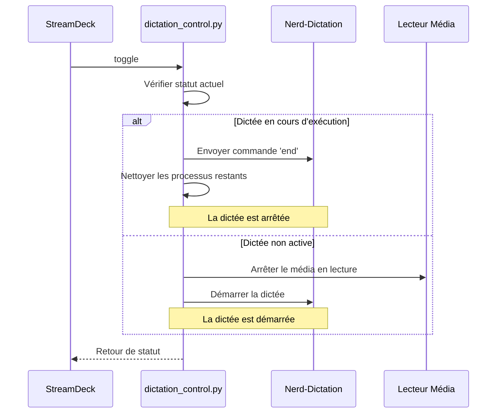
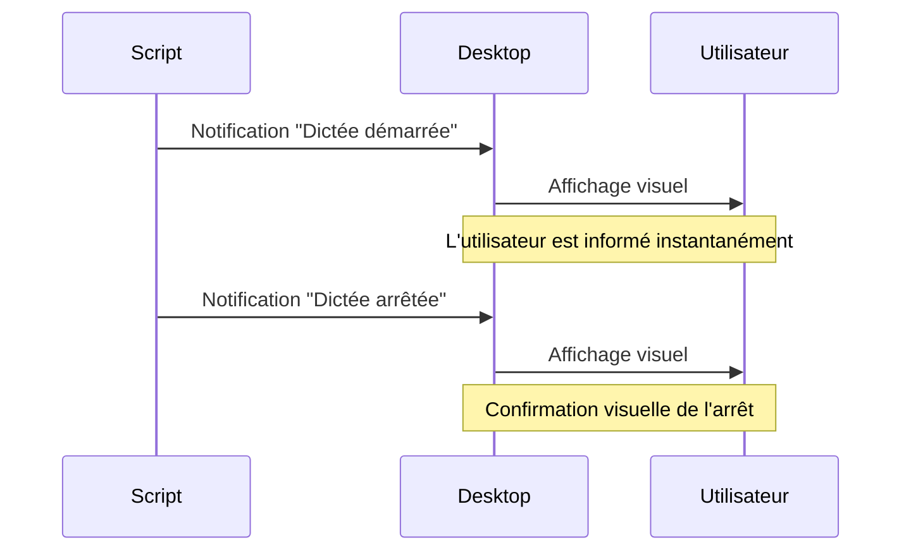
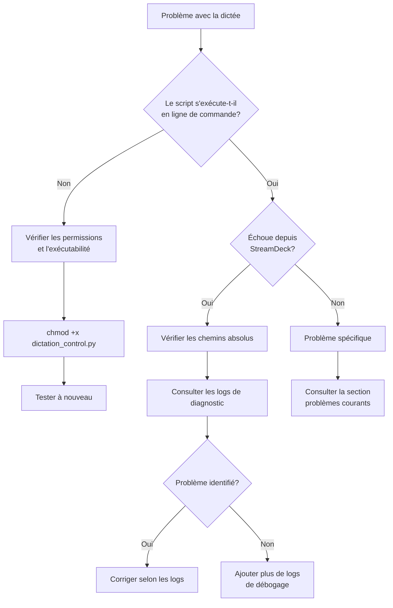

# Configuration de StreamDeck pour Nerd-Dictation

Ce guide explique comment configurer [streamdeck-linux-gui](https://github.com/streamdeck-linux-gui/streamdeck-linux-gui) pour contrôler le logiciel [Nerd-Dictation](https://github.com/ideasman42/nerd-dictation) via votre StreamDeck.

## Prérequis

- Un [Elgato StreamDeck](https://www.elgato.com/fr/fr/p/stream-deck-mk2-white)
- [streamdeck-linux-gui](https://github.com/streamdeck-linux-gui/streamdeck-linux-gui) installé et fonctionnel
- [Nerd-Dictation](https://github.com/ideasman42/nerd-dictation) installé et fonctionnel
- Le script `dictation_control.py` présent dans le même répertoire que votre installation de nerd-dictation
- Un environnement Python correctement configuré avec les dépendances requises (voir section suivante)

## Configuration de l'environnement Python

Nerd-Dictation nécessite plusieurs modules Python, notamment `vosk` pour la reconnaissance vocale. Sur les distributions Linux modernes, la gestion des paquets Python est souvent stricte (environnement géré en externe). Il est donc recommandé d'utiliser un environnement virtuel :

1. Vérifiez si un environnement virtuel existe déjà dans le répertoire de nerd-dictation :

   ```bash
   ls -la /chemin/vers/nerd-dictation/venv
   ```

2. Si l'environnement virtuel n'existe pas, créez-en un :

   ```bash
   cd /chemin/vers/nerd-dictation
   python3 -m venv venv
   ```

3. Activez l'environnement virtuel et installez les dépendances requises :

   ```bash
   source venv/bin/activate
   pip install vosk
   # Installez d'autres dépendances si nécessaire
   ```

## Utilisation du script Python

Le script Python `dictation_control.py` offre une solution robuste et fiable pour contrôler Nerd-Dictation depuis StreamDeck. Il offre un diagnostic avancé et peut être utilisé de plusieurs façons.

### Installation et test

1. Assurez-vous que le script est exécutable :

   ```bash
   chmod +x dictation_control.py
   ```

2. Vérifiez que le script fonctionne correctement :
   ```bash
   ./dictation_control.py status
   ```

### Méthode recommandée : Un seul bouton toggle

La façon la plus simple d'utiliser le script est avec la commande `toggle` qui basculera automatiquement entre démarrage et arrêt de la dictée :

1. Ouvrez streamdeck-linux-gui
2. Sélectionnez un bouton libre sur votre StreamDeck
3. Dans le panneau de configuration :
   - **Type d'action** : Choisissez "Commande"
   - **Commande** : Entrez le chemin complet vers le script Python avec la commande `toggle`
     ```
     /chemin/complet/vers/dictation_control.py toggle
     ```
   - **Texte** : "Dictée" (optionnel)
   - **Icône** : Ajoutez une icône représentant un microphone

Voici le flux de la fonction toggle :



### Méthode alternative : Boutons séparés

Si vous préférez des boutons distincts pour démarrer et arrêter la dictée :

1. **Bouton de démarrage** :

   - **Commande** :
     ```
     /chemin/complet/vers/dictation_control.py start
     ```

2. **Bouton d'arrêt** :
   - **Commande** :
     ```
     /chemin/complet/vers/dictation_control.py stop
     ```

## Fonctionnalités du script Python

Le script `dictation_control.py` offre de nombreux avantages :

- **Fonction toggle intelligente** : un seul bouton pour démarrer/arrêter la dictée
- **Diagnostic avancé** : journalisation complète pour faciliter le dépannage
- **Gestion robuste des processus** : terminaison propre des processus nerd-dictation
- **Contrôle média intégré** : arrêt automatique des lecteurs média lors du démarrage
- **Notifications desktop** : affichage de notifications visuelles lors du démarrage et de l'arrêt de la dictée
- **Gestion des erreurs** : capture et journalisation des exceptions

Les notifications desktop vous permettent de savoir instantanément quand la dictée est activée ou désactivée, même si vous travaillez dans une autre application.



## Résolution de problèmes

### Fichiers de journalisation

Pour diagnostiquer les problèmes, consultez les fichiers suivants :

```bash
# Log principal
cat /tmp/dictation_control.log

# Fichiers de diagnostic détaillés
cat /tmp/nerd-dictation-debug.log      # Sortie de test initial
cat /tmp/nerd-dictation-stdout.log     # Sortie standard
cat /tmp/nerd-dictation-stderr.log     # Sortie d'erreur
```

### Problèmes courants

1. **La dictée ne démarre pas** :

   - Vérifiez que les chemins dans le script sont corrects
   - Assurez-vous que le modèle VOSK est présent
   - Consultez les journaux pour plus de détails

2. **La dictée ne s'arrête pas** :

   - Exécutez manuellement `./dictation_control.py stop` pour diagnostic
   - Consultez les journaux pour identifier les processus qui ne répondent pas

3. **L'arrêt du média ne fonctionne pas** :

   - Vérifiez que xdotool ou playerctl est installé et fonctionne
   - Testez manuellement les commandes de contrôle média

4. **Les notifications ne s'affichent pas** :

   - Vérifiez que le paquet `libnotify-bin` est installé :
     ```bash
     sudo apt install libnotify-bin
     ```
   - Testez la commande manuellement :
     ```bash
     notify-send "Test" "Ceci est un test"
     ```
   - Si vous utilisez le script depuis un service ou un cron, vous devrez peut-être configurer l'accès au serveur DBUS
   - Sur certains bureaux minimalistes (i3, dwm, etc.), installez un gestionnaire de notifications comme `dunst`

5. **Erreur "No module named 'vosk'"** :

   - Cette erreur indique que le module Python `vosk` n'est pas accessible
   - Vérifiez que vous avez installé vosk dans l'environnement virtuel :
     ```bash
     source /chemin/vers/nerd-dictation/venv/bin/activate
     pip install vosk
     ```

6. **Problèmes lors de l'exécution depuis StreamDeck** :

   - Utilisez les chemins absolus dans la configuration
   - Assurez-vous que le fichier est exécutable (`chmod +x dictation_control.py`)
   - Consultez les fichiers de diagnostic détaillés

### Procédure de débogage recommandée



## Personnalisation

Vous pouvez personnaliser le script en modifiant les variables en haut du fichier :

- `SCRIPT_DIR` : Chemin absolu vers le répertoire contenant nerd-dictation
- `NERD_DICTATION` : Chemin vers l'exécutable nerd-dictation
- `VOSK_MODEL_DIR` : Chemin vers le répertoire du modèle VOSK
- `LOG_FILE` : Emplacement du fichier journal

### Personnalisation des notifications

Le script utilise `notify-send` pour afficher des notifications desktop. Vous pouvez personnaliser ces notifications en modifiant la fonction `send_notification()` dans le code :

- Changez le titre et le message des notifications
- Modifiez le niveau d'urgence (`low`, `normal`, `critical`)
- Ajoutez une icône personnalisée avec le paramètre `-i` dans la commande
- Définissez la durée d'affichage avec le paramètre `-t` (en millisecondes)

Exemples de personnalisation :

```python
# Notification avec icône personnalisée
subprocess.run(["notify-send", title, message, "-u", urgency, "-i", "/chemin/vers/icone.png"], check=False)

# Notification de 5 secondes
subprocess.run(["notify-send", title, message, "-u", urgency, "-t", "5000"], check=False)
```

Si les notifications ne s'affichent pas, vérifiez que :

- Le package `libnotify-bin` est installé (contient la commande `notify-send`)
- Un serveur de notification est en cours d'exécution sur votre bureau

## Exemples d'utilisation avancée

### Combiner dictée et action StreamDeck

Vous pouvez créer des profils dans StreamDeck qui combinent la dictée avec d'autres actions :

1. **Profil Dictée** : Activé par un bouton toggle, contient d'autres boutons pertinents pour la dictée
2. **Profil Édition** : Contient des boutons pour les commandes d'édition courantes
3. **Profil Média** : Pour contrôler la lecture des médias

### Personnalisation visuelle des boutons

Vous pouvez créer des icônes différentes pour indiquer l'état de la dictée :

- Microphone rouge : dictée inactive
- Microphone vert : dictée active

StreamDeck GUI permet de définir des icônes différentes selon l'état d'un bouton.

```

```
